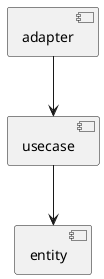
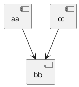

# depslint

This tool is a linter that checks dependencies based on import statements.  
This will help you practice things like clean architecture.

## Installation

```sh
go install github.com/ogugu9/depslint/cmd/depslint@latest
```

## Usage
First, create `.depslint.puml` like below.



Then, execute like below.

```sh
go vet -vettool=$(which depslint) -depslint.root=`pwd` ./...
```

## Example

Here is example for `.depslint.puml`.



And then target go file is below.

```go
package bb

import (
	"log"

	"github.com/ogugu9/a/aa"
	//lint:ignore depslint
	"github.com/ogugu9/a/cc"
	"go.uber.org/zap"
)

func BBB() {
	aa.AAA()
	cc.CCC()
	log.Println("AAA")
	logger, _ := zap.NewDevelopment()
	logger.Info("AAA")
}
```

The result will be like...

```sh
go vet -vettool=$(which depslint) -depslint.root=`pwd` ./...
# github.com/ogugu9/a/bb
bb/bb.go:6:2: dependency violation: github.com/ogugu9/a/bb -> github.com/ogugu9/a/aa
```
